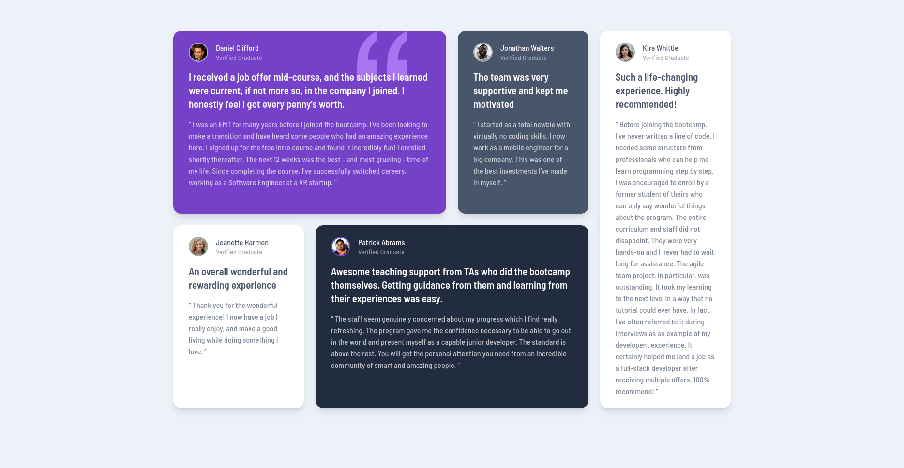

# Frontend Mentor - Testimonials grid section solution

This is a solution to the [Testimonials grid section challenge on Frontend Mentor](https://www.frontendmentor.io/challenges/testimonials-grid-section-Nnw6J7Un7). Frontend Mentor challenges help you improve your coding skills by building realistic projects. 

## Table of contents

- [Overview](#overview)
  - [The challenge](#the-challenge)
  - [Screenshot](#screenshot)
  - [Links](#links)
- [My process](#my-process)
  - [Built with](#built-with)
  - [What I learned](#what-i-learned)
- [Author](#author)

**Note: Delete this note and update the table of contents based on what sections you keep.**

## Overview

### The challenge

Users should be able to:

- View the optimal layout for the site depending on their device's screen size

### Screenshot

### Links

- Solution URL: [Solution URL](https://github.com/mondirhallouli/testimonial-grid-fem)
- Live Site URL: [Live site URL](https://your-live-site-url.com)

## My process

### Built with

- Semantic HTML5 markup
- CSS custom properties
- CSS Grid
- Mobile-first workflow
- [React](https://react.dev/) - JS library
- [TailwindCSS](https://tailwindcss.com/) - For styles

### What I learned

The main thing I had in my mind during this project is the approach I would adapt if this was a real section in a project. Instead of creating a different component for each card, I would probably have a single general card component that is populated with the data coming from the backend.

## Author

- Portfolio - [my-portfolio](https://www.mh-portfolio.pages.dev/)
- Frontend Mentor - [@mondirhallouli](https://www.frontendmentor.io/profile/mondirhallouli)
- Github - [@mondirhallouli](https://www.github.com/mondirhallouli)
